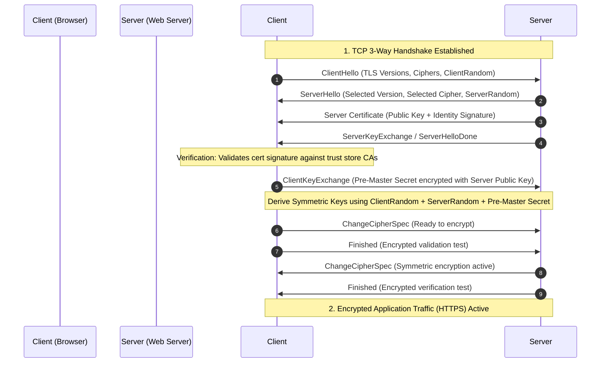

# Educational Guide: Network Sockets & Cryptographic SSL/TLS Handshakes

This reference document explains the networking, security, and cryptographic concepts behind **sockets**, **handshakes**, and **Public Key Infrastructure (PKI)** used in **Phase 4** of the Website Security Analyzer.

---

## 1. Network Sockets & Port Operations

### A. What is a Socket?
A **socket** is a software abstraction representing a terminal node for transmitting and receiving data across a network (IP address + Port).
* **IP Address:** Identifies the target machine (e.g. `142.250.190.46`).
* **Port:** Identifies the specific service running on that machine (e.g. `443` for HTTPS).

### B. TCP Sockets (`SOCK_STREAM`)
Our scanner opens a **TCP (Transmission Control Protocol)** socket. TCP is a **connection-oriented** protocol:
* **Reliability:** Guarantees packet delivery, ordering, and error-checking.
* **Handshake (The SYN/ACK Dance):** 
  1. Client sends a `SYN` (Synchronize) packet.
  2. Server responds with `SYN-ACK` (Synchronize-Acknowledge) if the port is open and listening.
  3. Client sends `ACK` (Acknowledge) to establish the circuit.

If a port is closed, the server responds with a `RST` (Reset) packet, and the socket raises a `ConnectionRefusedError`.

---

## 2. The SSL/TLS Cryptographic Handshake

Once the standard TCP connection is established, the application initiates the **TLS (Transport Layer Security)** cryptographic handshake. This adds encryption, authentication, and integrity checks over the raw TCP channel.

### Handshake Stages Explained:
1. **ClientHello:** The client announces its capabilities (supported TLS versions, cipher suites like AES, ChaCha20, and a random number `ClientRandom`).
2. **ServerHello:** The server selects the highest common secure TLS protocol version (e.g., TLSv1.3) and cipher suite, and sends its `ServerRandom`.
3. **Server Certificate:** The server sends its certificate containing its **Public Key** and identity signatures.
4. **Verification:** The client verifies the certificate.
5. **Key Exchange:** The client generates a `Pre-Master Secret`, encrypts it with the server's public key (using RSA/DH), and sends it.
6. **Key Derivation:** Both parties use the `ClientRandom`, `ServerRandom`, and `Pre-Master Secret` to derive identical **symmetric session keys**.
7. **Symmetric Encryption:** Both parties send `ChangeCipherSpec` indicating that all subsequent messages are encrypted using the symmetric keys.

---

## 3. Public Key Infrastructure (PKI) & Certificates

### A. Symmetric vs. Asymmetric Cryptography
* **Asymmetric (Public-Key) Cryptography:** Uses a **key pair** (a public key shared with everyone, and a private key kept secret).
  * *Purpose in TLS:* Used during the handshake for **identity verification** (authentication) and **key exchange**.
  * *Algorithms:* **RSA** (legacy, based on integer factorization) and **ECC** (modern, based on elliptic curves, offering stronger security with smaller keys).
* **Symmetric Cryptography:** Uses a **single shared key** for both encryption and decryption.
  * *Purpose in TLS:* Used to encrypt the actual application traffic because it is computationally faster than asymmetric math.
  * *Algorithms:* **AES** (Advanced Encryption Standard).

### B. Certificate Authorities (CAs) & Trust Stores
An SSL certificate binds a public key to a domain name. To prevent spoofing, a trusted third party must sign this binding:
1. **Certificate Authority (CA):** Entities like *Let's Encrypt*, *DigiCert*, or *Sectigo* verify ownership and sign certificates.
2. **Root Trust Store:** Operating systems and browsers come pre-installed with the root certificates of trusted CAs.
3. **Certificate Chain:** A domain's certificate is signed by an intermediate CA, which is signed by a Root CA. The browser traces this chain back to a root certificate in its trust store.

---

## 4. Key Security Parameters Checked

When auditing SSL/TLS configurations, we inspect:
* **Protocol Version:** Older versions (SSLv2, SSLv3, TLSv1.0, TLSv1.1) contain vulnerabilities (like POODLE and BEAST) and are deprecated. We verify the site negotiates **TLSv1.2** or **TLSv1.3**.
* **Validity Dates:** 
  * `notBefore`: The date the certificate becomes valid.
  * `notAfter`: The expiration date. Modern standards restrict certificate lifetimes to a maximum of **398 days** to limit exposure if keys are compromised.
* **Signature Hashing:** We check if the signature algorithm uses secure hashing (e.g., `SHA-256`) rather than deprecated algorithms (like `SHA-1` or `MD5`) which are vulnerable to collision attacks.
* **Key Strength (Key Size):**
  * **RSA Keys:** Must be at least **2048 bits** long. RSA 1024-bit is considered crackable by advanced actors.
  * **EC Keys:** Must be at least **256 bits** long (equivalent to RSA 3072-bit).
